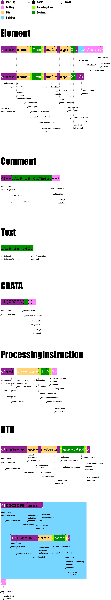

# forgiving-xml-parser


[](https://www.npmjs.com/package/forgiving-xml-parser)

Enligsh | [简体中文](./README.zh-CN.md)

An XML/HTML parser and serializer for JavaScript. [Playground](https://imingyu.github.io/forgiving-xml-parser/)


# Features

-   Transform XML/HTML to JSON(carry code locationInfo or parse steps)
-   Transform JSON back to XML
-   Works with node packages, in browser(like browser such as Miniprogram)
-   Various options are available to customize the transformation
    -   custom parsing behavior(souch as allow `node-name` is empty)
    -   supported events
    -   custom node parser

# Usage

-   1.install

```bash
# using npm
npm i forgiving-xml-parser -S
# using yarn
yarn add forgiving-xml-parser
```

-   2.include

```javascript
// in node
const ForgivingXmlParser = require('forgiving-xml-parser');
const json = ForgivingXmlParser.parse('...');

// in webpack
import {parse, serialize, ...} from 'forgiving-xml-parser';
const json = parse('...');
```

```html
<!-- in browser -->
<script src="xxx/forgiving-xml-parser.js"></script>
<script>
    // global variable
    const json = ForgivingXmlParser.parse("...");
</script>
```

-   3.use

```javascript
const { parse, serialize, parseResultToJSON, LxParser } = require("forgiving-xml-parser");

const xml = `<p>hi xml</p>`;
const json = parseResultToJSON(parse(xml)); // { "nodes": [{ "type": "element", "name": "p", "children": [{ "type": "text", "content": "hi xml" }] }] }

serialize(json); // <p>hi xml</p>

const lxParser = new LxParser();
const json2 = parseResultToJSON(lxParser.parse(xml));
console.log(JSON.stringify(json2) === JSON.stringify(json)); // true
console.log(lxParser.serialize(json2) === serialize(json)); // true
```

# Api

<details>
<summary>Functions</summary>

-   **parse**(xml: `String`, options?: [LxParseOptions](src/types.ts#L178-L181)): [LxParseResult](src/types.ts#L266-L271)

-   **parseResultToJSON**(result: [LxParseResult](src/types.ts#L266-L271), options?: [LxToJSONOptions](src/types.ts#L251-L257)): [LxParseResultJSON](src/types.ts#L258-L265)

-   **serialize**(json: [LxNodeJSON](src/types.ts#L287-L299) | [LxNodeJSON](src/types.ts#L287-L299)[], options?: [LxSerializeOptions](src/types.ts#L60-L62)): `String`

-   **new LxParser**(options?: [LxParserOptions](src/types.ts#L335-L338))

    -   **parse**(xml: `String`, options?: [LxParseOptions](src/types.ts#L178-L181)): [LxParseResult](src/types.ts#L266-L271)

    -   **parseResultToJSON**(result: [LxParseResult](src/types.ts#L266-L271), options?: [LxToJSONOptions](src/types.ts#L251-L257)): [LxParseResultJSON](src/types.ts#L258-L265)

    -   **serialize**(json: [LxNodeJSON](src/types.ts#L287-L299) | [LxNodeJSON](src/types.ts#L287-L299)[], options?: [LxSerializeOptions](src/types.ts#L60-L62)): `String`

</details>

<details>
<summary>Options</summary>

-   [LxParserOptions](src/types.ts#L335-L338)
-   [LxParseOptions](src/types.ts#L178-L181)
-   [LxToJSONOptions](src/types.ts#L251-L257)
-   [LxSerializeOptions](src/types.ts#L60-L62)
</details>

<details>
<summary>NodeAdapters</summary>
</details>

<details>
<summary>Event trigger timing</summary>




</details>
