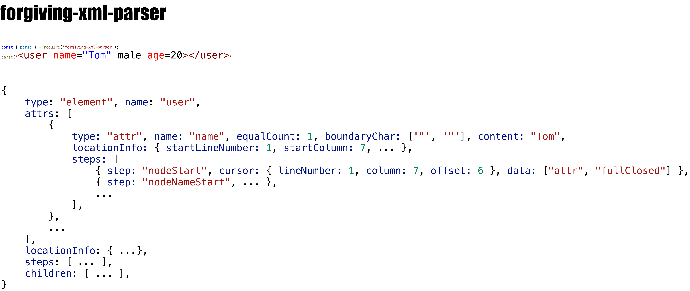

# forgiving-xml-parser

[](https://travis-ci.org/imingyu/forgiving-xml-parser)

[](https://www.npmjs.com/package/forgiving-xml-parser)
[](https://www.npmjs.com/package/forgiving-xml-parser)

[Enligsh](./README.md) | 简体中文

一个在 JavaScript 平台上提供解析、序列化 XML/HTML 功能的工具类库。[在线预览](https://imingyu.github.io/forgiving-xml-parser/)



# 功能列表

-   解析 XML/HTML 为 JSON（可携带代码位置信息与解析步骤）
-   将 JSON 序列化为 XML
-   可以当做 node 包的方式使用，同时也可以在浏览器或类浏览器环境（如小程序）中使用
-   提供多种自定义解析/序列化选项
    -   设置某些解析行为（如是否允许`节点名称`为空）
    -   支持事件
    -   自定义节点解析器/序列器，定制某些特定 xml/html 语法的解析和序列化行为

# 使用

-   1.安装

```bash
# 使用 npm 安装
npm i forgiving-xml-parser -S
# 使用 yarn 安装
yarn add forgiving-xml-parser
```

-   2.引用

```javascript
// 在NodeJs环境中
const ForgivingXmlParser = require('forgiving-xml-parser');
const json = ForgivingXmlParser.parse('...');

// 在Webpack等打包工具环境中
import {parse, serialize, ...} from 'forgiving-xml-parser';
const json = parse('...');
```

```html
<!-- 在浏览器环境中 -->
<script src="xxx/forgiving-xml-parser.js"></script>
<script>
    // 本工具会暴露全局变量ForgivingXmlParser
    const json = ForgivingXmlParser.parse("...");
</script>
```

-   3.使用

```javascript
const { parse, serialize, parseResultToJSON, FxParser } = require("forgiving-xml-parser");

const xml = `<p>hi xml</p>`;
const json = parseResultToJSON(parse(xml), {
    allowAttrContentHasBr: true,
    allowNodeNameEmpty: true,
    allowNodeNotClose: true,
    allowStartTagBoundaryNearSpace: true,
    allowEndTagBoundaryNearSpace: true,
    allowTagNameHasSpace: true,
    allowNearAttrEqualSpace: true,
    ignoreTagNameCaseEqual: false,
    onEvent(type, context, data) {},
}); // { "nodes": [{ "type": "element", "name": "p", "children": [{ "type": "text", "content": "hi xml" }] }] }

serialize(json); // <p>hi xml</p>

const fxParser = new FxParser();
const json2 = parseResultToJSON(fxParser.parse(xml));
console.log(JSON.stringify(json2) === JSON.stringify(json)); // true
console.log(fxParser.serialize(json2) === serialize(json)); // true
```

# Api

<details>
<summary>事件</summary>

| 事件                | 简介                           | 节点类型触发情况及次数                                                                                                                                    |                                |                                                                                                   |                      |                      |                      |                       |                      |     |
| ------------------- | ------------------------------ | --------------------------------------------------------------------------------------------------------------------------------------------------------- | ------------------------------ | ------------------------------------------------------------------------------------------------- | -------------------- | -------------------- | -------------------- | --------------------- | -------------------- | --- |
|                     |                                | Element                                                                                                                                                   | Element(selfclosing)           | Attr                                                                                              | Text                 | Comment              | CDATA                | ProcessingInstruction | DTD                  |
| `nodeStart`         | 节点开始解析                   | 必定触发，仅触发一次                                                                                                                                      | 同左                           | 同左                                                                                              | 同左                 | 同左                 | 同左                 | 同左                  | 同左                 |
| `nodeEnd`           | 节点解析完成                   | 节点正确关闭且不是`xml中`最后一个节点时触发，仅触发一次；<br>`<p><span></p>`中的`p`和`span`均会触发；<br>`<p></p><span>`中的`p`会触发，但是`span`不会触发 | 同左                           | 同左                                                                                              | 同左                 | 同左                 | 同左                 | 同左                  | 同左                 |
| `nodeNameStart`     | 节点名称开始解析               | `startTag`中包含名称时触发一次；<br>（`v1.1.0开始支持`）`endTag`中包含名称时触发一次                                                                      | `startTag`中包含名称时触发一次 | 包含名称时触发一次                                                                                | 不触发               | 不触发               | 不触发               | 同 Attr               | 同 Attr              |
| `nodeNameEnd`       | 节点名称解析完毕               | `startTag`中包含名称时触发一次；<br>（`v1.1.0开始支持`）`endTag`中包含名称时触发一次                                                                      | `startTag`中包含名称时触发一次 | 包含名称时触发一次                                                                                | 不触发               | 不触发               | 不触发               | 同 Attr               | 同 Attr              |
| `startTagStart`     | `startTag`部分开始解析         | 必定触发，仅触发一次                                                                                                                                      | 必定触发，仅触发一次           | 不触发                                                                                            | 不触发               | 必定触发，仅触发一次 | 必定触发，仅触发一次 | 必定触发，仅触发一次  | 必定触发，仅触发一次 |
| `attrsStart`        | `startTag`中的属性部分开始解析 | `startTag`包含属性部分时触发，仅触发一次；                                                                                                                | 同左                           | 不触发                                                                                            | 不触发               | 不触发               | 不触发               | 同 Element            | 同 Element           |
| `attrsEnd`          | `startTag`中的属性部分解析完成 | `startTag`包含属性部分时触发，仅触发一次；                                                                                                                | 同左                           | 不触发                                                                                            | 不触发               | 不触发               | 不触发               | 同 Element            | 同 Element           |
| `attrEqual`         | 属性遇到`=`                    | 不触发                                                                                                                                                    | 不触发                         | 属性中包含`=`时触发，触发一次或多次，取决于`options.encounterAttrMoreEqual`                       | 不触发               | 不触发               | 不触发               | 不触发                | 不触发               |
| `attrLeftBoundary`  | 属性遇到左边界符（如：`"'(`）  | 不触发                                                                                                                                                    | 不触发                         | 属性中包含左边界符时触发，触发一次，左边界符值读取属性父元素的`nodeAdapter.attrLeftBoundaryChar`  | 不触发               | 不触发               | 不触发               | 不触发                | 不触发               |
| `attrRightBoundary` | 属性遇到右边界符（如：`"')`）  | 不触发                                                                                                                                                    | 不触发                         | 属性中包含右边界符时触发，触发一次，右边界符值读取属性父元素的`nodeAdapter.attrRightBoundaryChar` | 不触发               | 不触发               | 不触发               | 不触发                | 不触发               |
| `startTagEnd`       | `startTag`部分解析完成         | `startTag`部分正确关闭时触发，仅触发一次；<br>`<user name="Tom">`会触发；<br>`<user name="Tom"`不会触发                                                   | 同左                           | 不触发                                                                                            | 不触发               | 同 Element           | 同 Element           | 同 Element            | 同 Element           |
| `nodeContentStart`  | 文本内容开始解析               | 不触发                                                                                                                                                    | 不触发                         | 属性中包含内容时触发，触发一次                                                                    | 必定触发，仅触发一次 | 同左                 | 同左                 | 不触发                | 不触发               |
| `nodeContentEnd`    | 文本内容解析完成               | 不触发                                                                                                                                                    | 不触发                         | 属性中包含内容时触发，触发一次                                                                    | 必定触发，仅触发一次 | 同左                 | 同左                 | 不触发                | 不触发               |
| `endTagStart`       | `endTag`部分开始解析           | 含有`endTag`部分时触发，仅触发一次；                                                                                                                      | 不触发                         | 不触发                                                                                            | 不触发               | 同 Element           | 同 Element           | 同 Element            | 同 Element           |
| `endTagEnd`         | `endTag`部分解析完成           | `endTag`部分正确关闭时触发，仅触发一次；                                                                                                                  | 不触发                         | 不触发                                                                                            | 不触发               | 同 Element           | 同 Element           | 同 Element            | 同 Element           |
| `error`             | 发生异常                       | 异常发生时触发，触发 0 到多次，范围：全局                                                                                                                 |

</details>

<details>
<summary>代码位置信息与解析步骤</summary>

**代码位置信息**

```typescript
interface FxLocation {
    startLineNumber: number; // 开始行号，行号从1开始
    endLineNumber?: number; // 结束行号
    startColumn: number; // 开始列号，列号从1开始
    endColumn?: number; // 结束列号
    startOffset: number; // 开始偏移索引号，偏移索引号从0开始
    endOffset?: number; // 结束偏移索引号
}
interface FxNodeLocationInfo extends FxLocation {
    startTag?: FxLocation; // startTag部分的代码位置信息
    endTag?: FxLocation; // endTag部分的代码位置信息
    attrs?: FxLocation[]; // 属性部分的代码位置信息，数组顺序为每个属性出现的顺序
}

interface FxNode {
    locationInfo: FxNodeLocationInfo;
}

// v1.1.0后变更：
interface FxNodeTagLocationInfo extends FxLocation {
    name?: FxLocation; // startTag|endTag部分中名称的位置信息
}
interface FxAttrLocationInfo extends FxLocation {
    name?: FxLocation; // 名称的位置信息
    content?: FxLocation; // 内容的位置信息
    leftBoundary?: FxCursorPosition; // 左边界符的位置信息
    rightBoundary?: FxCursorPosition; // 右边界符的位置信息
}
interface FxNodeLocationInfo extends FxLocation {
    startTag?: FxNodeTagLocationInfo; // startTag部分的代码位置信息
    endTag?: FxNodeTagLocationInfo; // endTag部分的代码位置信息
    attrs?: FxAttrLocationInfo[]; // 属性部分的代码位置信息，数组顺序为每个属性出现的顺序
}
```

**解析步骤**

```typescript
interface FxCursorPosition {
    lineNumber: number; // 行号，从1开始
    column: number; // 列号，从1开始
    offset: number; // 偏移索引号，从0开始
}
interface FxTryStep {
    step: FxEventType; // 解析阶段，值就是事件名称
    cursor: FxCursorPosition; // 当前阶段所处的光标位置
    data?: FxTryStepData; // 阶段数据，可以包含名称、节点解析器、关闭类型等
}
interface FxNode {
    steps?: FxTryStep[]; // 解析步骤
}
```

</details>

<details>
<summary>事件触发时机</summary>


</details>
